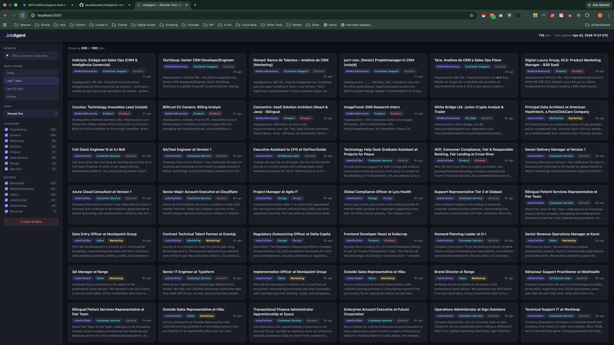
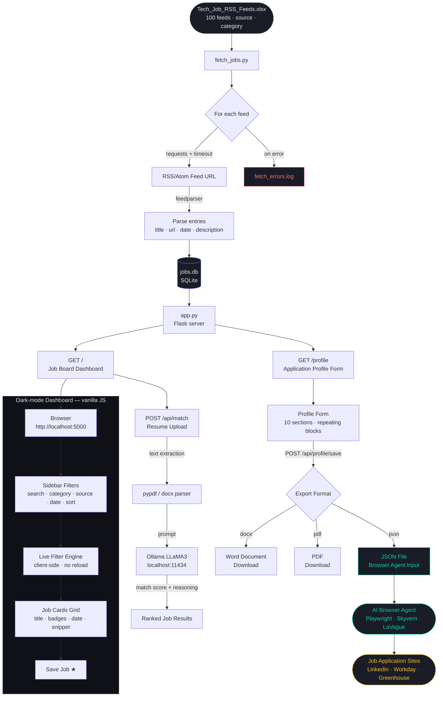

# JobAgent — AI Job Board + Application Autopilot

A fully local job aggregator that pulls listings from 100 tech job feeds, matches them to your resume with AI, and lets you fill out a single **Application Profile** that browser agents can use to auto-apply on your behalf.

    

---

## Dashboard



---

## Features

| Feature | Detail |
|---|---|
| RSS Aggregator | 100 feeds across Engineering, AI/ML, DevOps, Data, Security, Design, Web3, and more |
| Local SQLite | All jobs stored locally — no API keys, no external services |
| Dark-mode Dashboard | Live search, category/source filters, date range, sort, pagination |
| AI Resume Match | Upload your resume → LLaMA3 scores every job for fit |
| Saved Jobs | Bookmark roles and review them in a dedicated tab |
| **Application Profile** | Form that captures everything needed to auto-apply — exports to Word, PDF, or JSON |
| **Browser Agent Ready** | JSON export feeds directly into AI browser agents (e.g. Playwright, Skyvern, LaVague) |
| Resilient Fetcher | Skips failed feeds and logs errors; never crashes mid-run |

---

## Application Profile Form

`http://localhost:5000/profile`

Fill this out once and your browser agent handles the rest. The form covers every field a job application typically asks for beyond your resume and cover letter:

- **Personal Info** — name, email, phone, location, LinkedIn, GitHub, portfolio
- **Work Eligibility** — visa status, sponsorship needs, remote/hybrid preference, start date
- **Work History** — repeating blocks for each role (title, company, dates, responsibilities, manager)
- **Education** — degrees, majors, GPA, graduation dates
- **Skills & Certifications** — tech stack, tools, languages, licenses
- **Screening Answers** — pre-written responses to "Why this company?", strengths, 5-year plan, etc.
- **Portfolio / Work Samples** — project links with descriptions
- **References** — names, titles, contact info
- **Compensation** — desired salary range, currency, notes for negotiation
- **EEO & Compliance** — optional diversity fields, background check consent

### Export formats

| Format | Use case |
|---|---|
| `.docx` | Human-readable copy, works out of the box |
| `.pdf` | Requires `pip install docx2pdf` |
| `.json` | Machine-readable flat file — feed directly to a browser agent |

---

## Quickstart

> **Windows users:** fully supported on Windows 10/11. Use the same commands below in PowerShell, Command Prompt, or Git Bash.

### 1. Install dependencies
```bash
pip install -r requirements.txt
```

### 2. Fetch jobs (~5–10 min on first run)
```bash
python fetch_jobs.py
```
Reads all feeds from `Tech_Job_RSS_Feeds.xlsx`, stores results in `jobs.db`. Feed errors are logged to `fetch_errors.log` and skipped automatically.

### 3. Start the server
```bash
python app.py
```

| URL | Page |
|---|---|
| http://localhost:5000 | Job board dashboard |
| http://localhost:5000/profile | Application profile form |

---

## Project Structure

```
JobAgent/
├── fetch_jobs.py              # RSS fetcher — reads XLSX, populates jobs.db
├── app.py                     # Flask server — dashboard + AI match + profile form
├── requirements.txt           # Python dependencies
├── Tech_Job_RSS_Feeds.xlsx    # 100 RSS feed URLs with source/category metadata
└── README.md
```

> `jobs.db` and `fetch_errors.log` are generated at runtime.

---

## Dependencies

```
feedparser     — RSS/Atom feed parsing
flask          — Web server
openpyxl       — Read .xlsx feed list
requests       — HTTP fetching with timeout support
pypdf          — PDF resume parsing
python-docx    — Profile export to .docx
docx2pdf       — (optional) Profile export to PDF
```

---

## System Design



---

## Notes

- ~55 of 100 feeds are currently active; the rest return 404/403/410 (dead or blocked URLs)
- Indeed and Upwork RSS feeds are blocked; Dice RSS endpoints are defunct
- Run `fetch_jobs.py` on a schedule (e.g. daily cron) to keep jobs fresh
- AI matching requires [Ollama](https://ollama.com) running locally with the `llama3.2` model pulled
