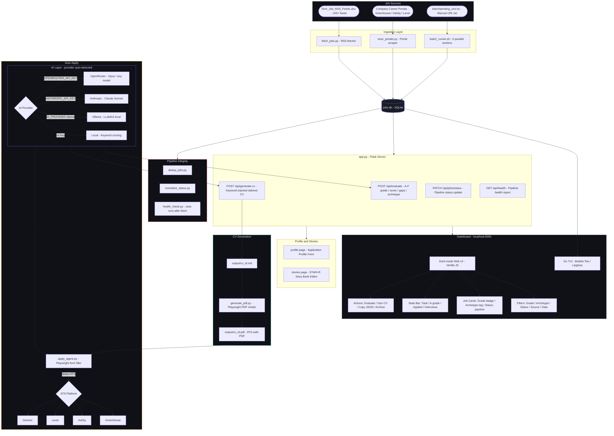

# JobAgent v2 — AI Job Search Command Center

A fully local AI job search pipeline. Aggregates 100+ RSS feeds, scores every role against your CV with an A-F grading engine, generates ATS-optimized tailored CVs per job, scans company career portals directly, and auto-fills application forms via Playwright — all running on your machine.


---

## What's New in v2

| v1 | v2 |
|---|---|
| Basic LLaMA3 match score | **A-F grading across 10 weighted dimensions** via Claude API or OpenRouter |
| No job classification | **Archetype detection** (AI/ML Engineer, DevOps, PM, etc.) |
| RSS feeds only | **Direct portal scanning** — Greenhouse, Ashby, Lever APIs |
| Profile export (DOCX/PDF/JSON) | **Per-job tailored CV** — ATS-keyword injected, Playwright PDF render |
| No application automation | **Playwright form filler** — detects ATS, fills fields, confirms before submit |
| No interview prep | **STAR+R story bank** with browser editor |
| Single AI provider | **Claude API + OpenRouter (Opus)** — auto-detected, fallback chain |
| No status tracking | **Pipeline status** per job: New → Applied → Interview → Offer |

---

## Features

| Feature | Detail |
|---|---|
| **RSS Aggregator** | 100+ feeds across Engineering, AI/ML, DevOps, Data, Security, Design, Web3 |
| **A-F Grading** | 10 weighted dimensions scored per job vs your `cv.md` — grade, score 0–100, gap bullets |
| **Archetype Detection** | Classifies each job: AI/ML Engineer, DevOps/MLOps, PM, Backend, Frontend, etc. |
| **ATS CV Generation** | Claude/Opus extracts JD keywords, rewrites bullet points, renders ATS-safe PDF |
| **Portal Scanner** | Directly queries Greenhouse, Ashby, Lever APIs for 30+ AI/tech companies |
| **Playwright Form Filler** | Auto-fills job application forms, calls AI for custom free-text answers |
| **Status Pipeline** | Per-job status cycling: New → Saved → Applied → Phone Screen → Interview → Offer |
| **STAR+R Story Bank** | Browser-editable behavioral interview story library |
| **Batch Processor** | 5 parallel workers — drop URLs in a file, pipeline does the rest |
| **Pipeline Integrity** | Dedup, status normalizer, health check auto-runs after each fetch |
| **Go TUI** | Terminal dashboard (Bubble Tea + Lipgloss, Catppuccin Mocha) |
| **Dark-mode Dashboard** | Grade badges, archetype tags, status filters, stats bar, live search |

---

## How to Use

### Step 1 — Install dependencies

```bash
git clone https://github.com/ekuelkpodar/JobAgents.git
cd JobAgents
python3 -m venv venv && source venv/bin/activate   # Windows: venv\Scripts\activate
pip install -r requirements.txt
playwright install chromium   # only needed for CV PDF generation and form filling
```

### Step 2 — Set your AI provider

Pick **one** (or both — the app auto-detects and falls back):

**Option A: OpenRouter** — gives you access to Opus and any other model with one key

```bash
export OPENROUTER_API_KEY=sk-or-...
export OPENROUTER_MODEL=anthropic/claude-opus-4-5   # default, can change to any model
```

**Option B: Anthropic Claude API directly**

```bash
export ANTHROPIC_API_KEY=sk-ant-...
```

**Option C: No API key** — the app still works using local keyword-based scoring (no AI grading). Useful for browsing and searching without any cost.

> **Priority:** If both keys are set, you can choose with `export AI_PROVIDER=openrouter` or `export AI_PROVIDER=claude`. Otherwise the app auto-picks: OpenRouter → Claude → local.

### Step 3 — Add your CV

Edit `cv.md` with your real experience. This is what the AI scores every job against and uses to generate tailored CVs.

```bash
# Template is already at cv.md — fill it in:
open cv.md   # or code cv.md, nano cv.md, etc.
```

### Step 4 — Fetch jobs

```bash
python fetch_jobs.py
```

Reads all 100+ RSS feeds from `Tech_Job_RSS_Feeds.xlsx`, stores results in `jobs.db`. Automatically runs a health check when done.

### Step 5 — Start the server

```bash
python app.py
```

| URL | What it is |
|---|---|
| [http://localhost:5000](http://localhost:5000) | Job board dashboard |
| [http://localhost:5000/profile](http://localhost:5000/profile) | Application profile form |
| [http://localhost:5000/stories](http://localhost:5000/stories) | Interview story bank editor |

### Step 6 — Score jobs against your CV

In the dashboard sidebar, click **Evaluate All** to grade every job in the background. Or click the **⚡ Evaluate** button on a specific card.

Each job gets:
- A letter grade (**A** = 85+, **B** = 70–84, **C** = 55–69, **D** = 40–54, **F** < 40)
- A numeric score 0–100
- An archetype label
- A 3-bullet gap analysis

### Step 7 — Generate a tailored CV

Click **📄 Gen CV** on any job card. The AI:
1. Extracts the top ATS keywords from the job description
2. Rewrites your CV bullets to naturally include them
3. Renders an ATS-safe PDF (no tables, no columns, Space Grotesk font)

The PDF downloads automatically.

### Step 8 — Scan company career portals directly

Click **🔍 Scan Portals** in the stats bar. This hits Greenhouse/Ashby/Lever APIs directly for 30+ pre-configured AI companies (Anthropic, ElevenLabs, Notion, n8n, etc.) and adds relevant roles to the DB.

To add more companies, edit `config/portals.yml`.

### Step 9 — Auto-fill an application

```bash
python apply_agent.py <job_id>
```

Or click **View →** on a job card to get the URL, then run the agent. It:
1. Opens a real browser (headed — you can watch)
2. Detects the ATS (Greenhouse, Ashby, Lever, or generic)
3. Fills all fields from `data/profile.json`
4. Calls the AI for free-text answers ("Why this company?", etc.)
5. Uploads your tailored PDF CV if one exists
6. **Pauses and asks you to confirm before submitting**

### Step 10 — Batch process a list of URLs

Add job URLs to `batch/pending_urls.txt` (one per line), then:

```bash
bash batch_runner.sh
```

Processes 5 at a time in parallel. Results in `batch/batch_results.tsv`.

---

## AI Provider Reference

| Provider | How to set | Default model | Best for |
|---|---|---|---|
| OpenRouter | `OPENROUTER_API_KEY` | `anthropic/claude-opus-4-5` | Highest quality scoring + CV gen |
| Anthropic | `ANTHROPIC_API_KEY` | `claude-sonnet-4-6` | Direct API access |
| Ollama | `AI_PROVIDER=ollama` | `llama3.2` | Fully local, no cost |
| Local | *(no key)* | keyword matching | Browse only, no AI |

Switch models via `OPENROUTER_MODEL=openai/gpt-4o` (or any OpenRouter-supported model).

---

## Project Structure

```
JobAgents/
├── app.py                      # Flask server — all routes and AI logic
├── fetch_jobs.py               # RSS fetcher — reads XLSX, populates jobs.db
├── scan_portals.py             # Direct career portal scraper (Greenhouse/Ashby/Lever)
├── apply_agent.py              # Playwright application form filler
├── generate_pdf.py             # Playwright ATS-safe CV PDF renderer
├── health_check.py             # Pipeline health reporter (auto-runs after fetch)
├── dedup_jobs.py               # Remove duplicate jobs from jobs.db
├── normalize_status.py         # Canonicalize all job status values
├── batch_runner.sh             # Parallel batch URL processor (5 workers)
│
├── cv.md                       # YOUR BASE CV — fill this in (used for all AI tasks)
├── CLAUDE.md                   # Agent instructions for Claude Code
│
├── config/
│   ├── portals.yml             # Company career portal configs (30+ pre-loaded)
│   └── profile.example.yml    # Template for data/profile.json
│
├── templates/
│   └── states.yml              # Canonical job status definitions
│
├── dashboard/
│   ├── main.go                 # Go TUI (Bubble Tea + Lipgloss)
│   └── go.mod
│
├── modes/                      # Claude Code slash command docs
│   ├── evaluate.md
│   └── _shared.md
│
├── data/                       # gitignored — your private data
│   ├── profile.json            # Application profile (copy from config/profile.example.yml)
│   ├── stories.md              # STAR+R interview story bank
│   └── applications.tsv        # Application log
│
├── output/                     # gitignored — generated CVs (md + pdf)
├── reports/                    # gitignored — interview prep reports
├── batch/
│   └── pending_urls.txt        # Drop job URLs here for batch processing
│
├── Tech_Job_RSS_Feeds.xlsx     # 100+ RSS feed URLs with source/category metadata
└── requirements.txt
```

---

## System Design



---

## Maintenance Commands

```bash
# Re-fetch all RSS feeds (run daily via cron)
python fetch_jobs.py

# Scan company career portals for new listings
python scan_portals.py

# Remove duplicate job entries
python dedup_jobs.py

# Standardize all status values
python normalize_status.py

# Run health check manually
python health_check.py

# Batch process URLs from batch/pending_urls.txt
bash batch_runner.sh

# Check which AI provider is active
curl http://localhost:5000/api/provider
```

---

## API Reference

| Method | Route | Description |
|---|---|---|
| `GET` | `/api/jobs` | All jobs |
| `GET` | `/api/jobs/<id>` | Single job with full fields |
| `PATCH` | `/api/jobs/<id>/status` | Update pipeline status |
| `POST` | `/api/evaluate/<id>` | Score a job against cv.md |
| `POST` | `/api/evaluate-all` | Score all unscored jobs (background) |
| `POST` | `/api/generate-cv/<id>` | Generate tailored ATS CV |
| `GET` | `/api/download-cv/<id>` | Download generated CV PDF |
| `POST` | `/api/scan` | Trigger portal scan (background) |
| `POST` | `/api/apply/<id>` | Launch Playwright form filler |
| `POST` | `/api/batch` | Run batch_runner.sh (background) |
| `GET` | `/api/provider` | Show active AI provider + model |
| `GET` | `/api/health` | Pipeline health report |
| `GET` | `/api/stats` | Job count by category/source/date |
| `POST` | `/api/upload-resume` | Parse a resume file |
| `POST` | `/api/refresh` | Re-fetch all RSS feeds (background) |
| `GET/POST` | `/api/stories` | Read/write interview story bank |
| `GET` | `/api/saved-jobs` | Bookmarked jobs |

---

## Notes

- **cv.md is required** for AI scoring and CV generation — fill it in before clicking Evaluate
- **data/profile.json** is required for the form filler — copy from `config/profile.example.yml`
- `jobs.db` is gitignored — regenerate it with `fetch_jobs.py`
- ~55 of 100 RSS feeds are active; dead feeds are logged to `fetch_errors.log` and skipped
- Run `fetch_jobs.py` on a daily cron to keep jobs fresh
- The Go TUI requires Go 1.21+ (`brew install go`) — `cd dashboard && go run .`
